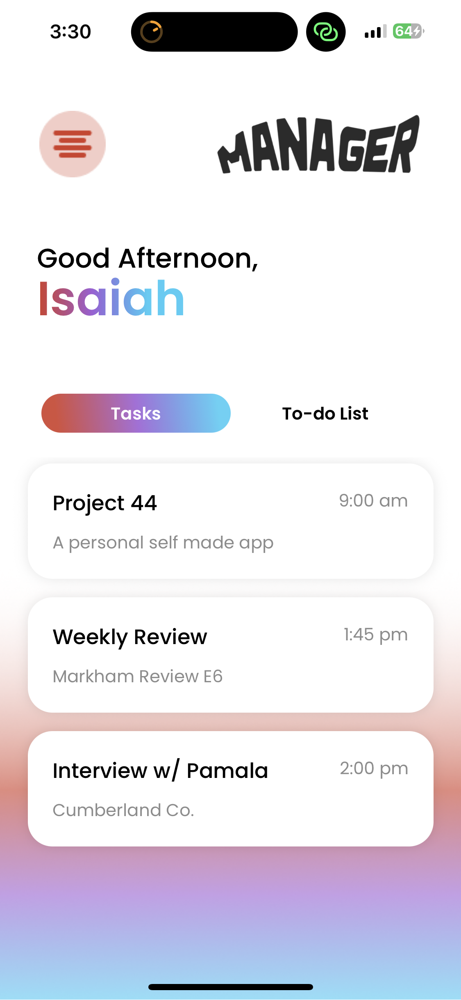

# _**Task & To-Do List Manager**_
> **Last Updated:** July 18th, 2026

## Project Summary

Task & To-Do List Manager is a mobile productivity application designed to help users organize, track, and manage daily tasks through an intuitive and user-friendly interface.

The application was developed using React Native with Expo to gain hands-on experience with mobile application development, user authentication, database integration, and CRUD-based application functionality.

> **Project Status:** 🚧 In Development (Archived)
>
> This project was paused while focusing on larger academic projects and my senior Capstone project. Although unfinished, the application demonstrates experience building a mobile application with authentication, task management functionality, and cloud database integration.

---

## Project Preview

The application includes completed screens for user authentication, navigation, task management, and task details.

### Welcome Screen

### Login Screen

### Home Screen

### Home Screen (ToDo List Screen)

### Detailed Task Screen

## Core Elements

- User Authentication:
  - Provides user account creation and login functionality.
  - Supports user session management.

- Task Management:
  - Create, view, update, and delete tasks.
  - Display task information through organized screens.

- Task Organization:
  - Manage personal to-do items.
  - View task summaries and detailed task information.

- Mobile User Interface:
  - Designed a mobile-first experience using React Native and Expo.
  - Implemented navigation between application screens.

#### Current Features

- User login functionality
- User logout functionality
- Home screen
- Task list screen
- Detailed task screen
- To-do list functionality *(completed/in progress)*
- Appwrite backend integration

---

### Technology Stack

#### Frontend
- React Native
- Expo
- JavaScript

#### Backend
- Appwrite

#### Database
- Appwrite Database

#### Development Tools
- Visual Studio Code
- Expo Go
- Git
- GitHub

---

## Getting Started

This repository contains the source code for the Task & To-Do List Manager mobile application.

### Repository Contents

- React Native mobile application
- Authentication screens
- Task management components
- Application assets

### Prerequisites

Before running the project, install:

- Node.js
- npm
- Expo CLI
- Expo Go mobile application
- Appwrite account

---

## Current Progress

Completed portions of the project include:

- Mobile application setup using Expo
- User authentication screens
- Login and logout functionality
- Home screen interface
- Task screen interface
- Detailed task view
- Initial task management functionality

Future improvements that were planned:

- Task categories
- Due dates and reminders
- Priority levels
- Task filtering and searching
- Improved UI design
- Additional productivity features

---

## Purpose

This project was created to develop practical experience with:

- React Native mobile development
- Expo application workflow
- Component-based architecture
- Authentication systems
- Cloud database integration
- CRUD operations
- Mobile UI/UX design

Although the project was not fully completed, it provided valuable experience in mobile application development and contributed to the technical foundation used in later software projects.

---

## Contact

### Created by: Isaiah Adams

> LinkedIn: www.linkedin.com/in/isaiah-j-adams
>
> Email: IJAdams1@outlook.com

Thank you for taking the time to explore this project. Feedback and suggestions are always welcome.
